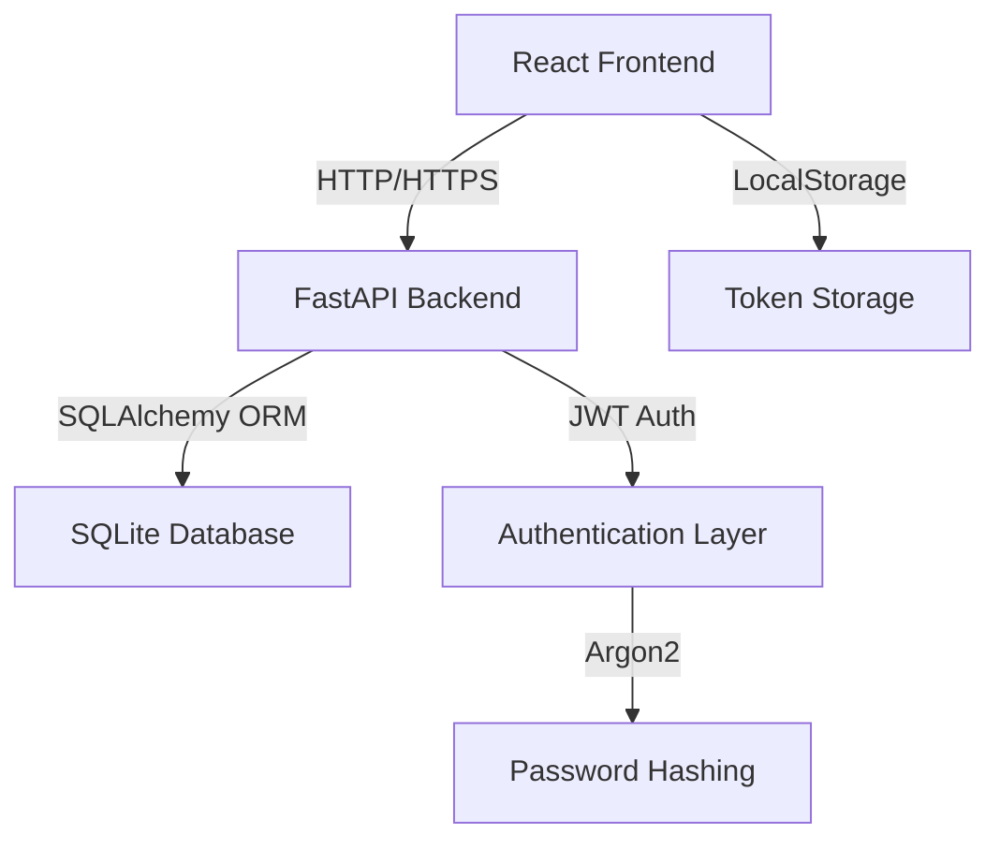

# Аналіз системи Python-web

## 1. Огляд архітектури системи

### 1.1 Backend (Server)
- **Framework**: FastAPI
- **Database**: SQLite з SQLAlchemy ORM
- **Authentication**: JWT токени з Argon2 хешуванням паролів
- **CORS**: Налаштований для роботи з frontend
- **Deployment**: Render (https://python-web-back.onrender.com)

### 1.2 Frontend (Client)
- **Framework**: React + Vite
- **Styling**: TailwindCSS
- **Routing**: React Router
- **State Management**: React useState/useEffect hooks
- **Icons**: Lucide React

### 1.3 Основні компоненти системи



## 2. Потенційні місця відмови системи

### 2.1 Рівень бази даних

#### 2.1.1 Відсутність обробки помилок при записі
**Умови відмови:**
- Одночасний доступ до бази даних (race conditions)
- Переповнення диску
- Блокування таблиць (SQLite lock)
- Порушення унікальних обмежень

**Критичність**: 🔴 ВИСОКА

**Приклад коду з проблемою:**
```python
# main.py, lines 85-87
user = User(...)
db.add(user)
db.commit()  # Немає обробки помилок
```

#### 2.1.2 Відсутність транзакцій для замовлень
**Умови відмови:**
- Помилка при створенні OrderItems після створення Order
- Часткове створення замовлення без товарів
- Неконсистентність даних

**Критичність**: 🔴 ВИСОКА

**Проблемний код:**
```python
# main.py, lines 117-139
db_order = Order(...)
db.add(db_order)
db.commit()

for item in order.items:
    db_item = OrderItem(...)
    db.add(db_item)  # Якщо помилка тут - Order вже створений

db.commit()
```

#### 2.1.3 Відсутність індексів для пошуку
**Умови відмови:**
- Повільні запити при великій кількості даних
- Timeout при пошуку користувачів або замовлень

**Критичність**: 🟡 СЕРЕДНЯ

### 2.2 Рівень API

#### 2.2.1 Відсутність валідації даних
**Умови відмови:**
- Від'ємні ціни або кількості
- Порожні обов'язкові поля
- SQL injection (частково захищено ORM)
- XSS атаки через некоректні дані

**Критичність**: 🔴 ВИСОКА

**Приклад:**
```python
# schemas.py - немає валідації
class OrderItemCreate(BaseModel):
    product_name: str
    quantity: int  # Немає перевірки на > 0
    price: float   # Немає перевірки на >= 0
```

#### 2.2.2 Відсутність rate limiting
**Умови відмови:**
- DDoS атаки
- Спам реєстрацій
- Навантаження на базу даних

**Критичність**: 🔴 ВИСОКА

#### 2.2.3 Hardcoded SECRET_KEY
**Умови відмови:**
- Компрометація токенів
- Несанкціонований доступ
- Неможливість ротації ключів

**Критичність**: 🔴 КРИТИЧНА

```python
# auth.py, line 5
SECRET_KEY = "SECRET_KEY_CHANGE_ME"  # Небезпечно!
```

#### 2.2.4 Відсутність обробки помилок мережі
**Умови відмови:**
- Timeout запитів
- Відсутність зв'язку з базою даних
- Падіння сервера

**Критичність**: 🟡 СЕРЕДНЯ

### 2.3 Рівень автентифікації

#### 2.3.1 Відсутність refresh токенів
**Умови відмови:**
- Втрата сесії після 24 годин
- Необхідність повторного входу

**Критичність**: 🟡 СЕРЕДНЯ

#### 2.3.2 Відсутність перевірки сили пароля
**Умови відмови:**
- Слабкі паролі (1234)
- Легкий підбір паролів

**Критичність**: 🟠 ВИСОКА

#### 2.3.3 Немає захисту від brute-force атак
**Умови відмови:**
- Підбір паролів
- Компрометація облікових записів

**Критичність**: 🔴 ВИСОКА

### 2.4 Рівень Frontend

#### 2.4.1 Відсутність обробки помилок при завантаженні продуктів
**Умови відмови:**
- Backend недоступний
- Timeout мережі
- Невалідні дані від API

**Критичність**: 🟡 СЕРЕДНЯ

**Проблемний код:**
```javascript
// MainPage.jsx, lines 26-53
try {
  const response = await fetch('https://python-web-back.onrender.com/products');
  if (!response.ok) throw new Error('Failed to fetch products');
  // Але немає повторних спроб
} catch (err) {
  setError('Не вдалося завантажити товари. Спробуйте пізніше.');
  // Користувач не може нічого зробити
}
```

#### 2.4.2 Відсутність валідації форм на frontend
**Умови відмови:**
- Некоректні дані відправляються на backend
- Погана UX

**Критичність**: 🟡 СЕРЕДНЯ

#### 2.4.3 Токени зберігаються в localStorage
**Умови відмови:**
- XSS атаки можуть вкрасти токени
- Немає автоматичного logout

**Критичність**: 🟠 ВИСОКА

#### 2.4.4 Hardcoded API URL
**Умови відмови:**
- Неможливо легко змінити backend URL
- Проблеми з development/production

**Критичність**: 🟢 НИЗЬКА

```javascript
// MainPage.jsx, line 30
const response = await fetch('https://python-web-back.onrender.com/products');
```

### 2.5 Інтеграційні точки

#### 2.5.1 CORS налаштування
**Умови відмови:**
- Дозволено всі origins (`allow_origins=["*"]`)
- Можливі CSRF атаки

**Критичність**: 🔴 ВИСОКА

```python
# main.py, lines 39-45
app.add_middleware(
    CORSMiddleware,
    allow_origins=["*"],  # Небезпечно!
    ...
)
```

#### 2.5.2 Немає версіонування API
**Умови відмови:**
- Breaking changes порушують frontend
- Немає можливості підтримувати старі версії

**Критичність**: 🟡 СЕРЕДНЯ

## 3. Критичні сценарії відмови

### 3.1 Сценарій 1: Одночасне створення користувачів з однаковим username

**Кроки:**
1. Два користувачі одночасно намагаються зареєструватися з username "john"
2. Обидва запити проходять перевірку `existing = db.query(User).filter...`
3. Обидва намагаються створити користувача
4. SQLite викидає помилку унікального обмеження
5. Один запит падає, але помилка не обробляється

**Наслідки:** 500 Internal Server Error, погана UX

### 3.2 Сценарій 2: Помилка при створенні OrderItems

**Кроки:**
1. Користувач створює замовлення з 3 товарами
2. Order успішно створюється і комітиться
3. При створенні 2-го OrderItem виникає помилка (наприклад, DB lock)
4. Транзакція не відкочується
5. В базі залишається Order без всіх Items

**Наслідки:** Неконсистентні дані, втрата інформації про товари

### 3.3 Сценарій 3: Витік JWT SECRET_KEY

**Кроки:**
1. Код публікується в GitHub з hardcoded SECRET_KEY
2. Зловмисник знаходить SECRET_KEY
3. Генерує токени для будь-якого користувача, включаючи admin
4. Отримує повний доступ до системи

**Наслідки:** Повна компрометація безпеки

### 3.4 Сценарій 4: DDoS на endpoint /register

**Кроки:**
1. Зловмисник надсилає 10000 запитів на /register за секунду
2. Немає rate limiting
3. Сервер створює 10000 користувачів
4. База даних переповнюється
5. Сервер падає

**Наслідки:** Denial of Service, недоступність системи

### 3.5 Сценарій 5: XSS через product name

**Кроки:**
1. Адміністратор створює продукт з назвою `<script>alert('XSS')</script>`
2. Frontend відображає назву без санітизації
3. JavaScript виконується в браузері користувача
4. Можливе викрадення токенів з localStorage

**Наслідки:** Компрометація облікових записів користувачів

## 4. Рекомендації щодо покращення

### 4.1 Пріоритет 1 (КРИТИЧНО)
1. ✅ Винести SECRET_KEY в змінні оточення
2. ✅ Додати валідацію даних на рівні Pydantic schemes
3. ✅ Обгорнути створення замовлень в транзакції
4. ✅ Обробити всі database exceptions
5. ✅ Налаштувати CORS на конкретні origins
6. ✅ Додати rate limiting (slowapi або middleware)

### 4.2 Пріоритет 2 (ВИСОКИЙ)
1. ✅ Додати валідацію сили пароля
2. ✅ Додати захист від brute-force (login attempts limit)
3. ✅ Додати санітизацію HTML на frontend
4. ✅ Додати повторні спроби для мережевих запитів
5. ✅ Покращити обробку помилок на frontend

### 4.3 Пріоритет 3 (СЕРЕДНІЙ)
1. ✅ Додати refresh токени
2. ✅ Додати версіонування API (/api/v1/)
3. ✅ Додати індекси для часто використовуваних запитів
4. ✅ Перенести токени з localStorage в httpOnly cookies

## 5. Висновки

Система має **12 критичних** та **8 високопріоритетних** потенційних місць відмови. Найбільш критичні проблеми стосуються:
- **Безпеки**: hardcoded secrets, CORS, XSS, brute-force
- **Цілісності даних**: відсутність транзакцій, обробки помилок
- **Доступності**: відсутність rate limiting, обробки мережевих помилок

Для забезпечення стійкості системи необхідно в першу чергу реалізувати рекомендації Пріоритету 1.
